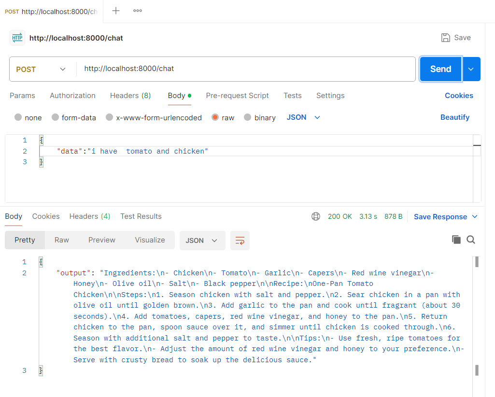
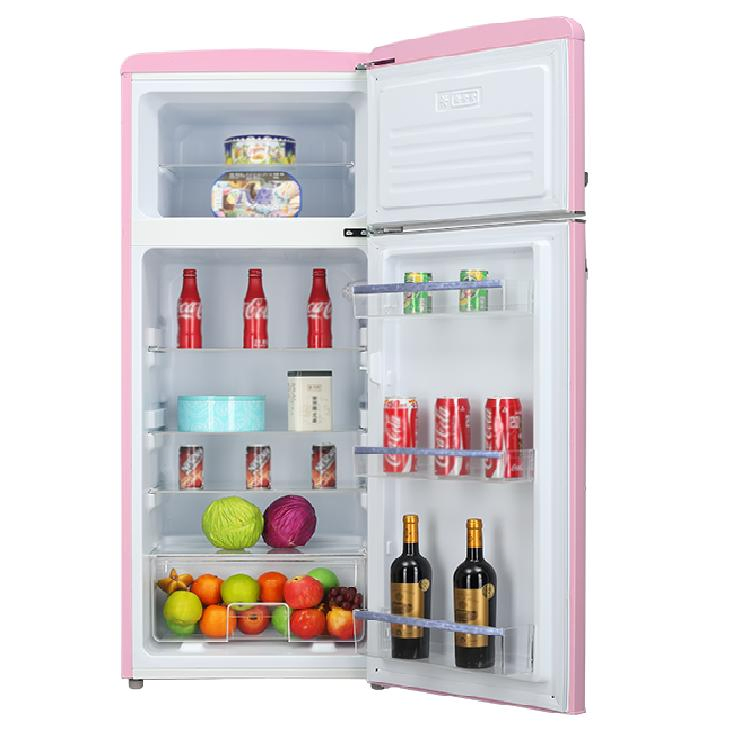
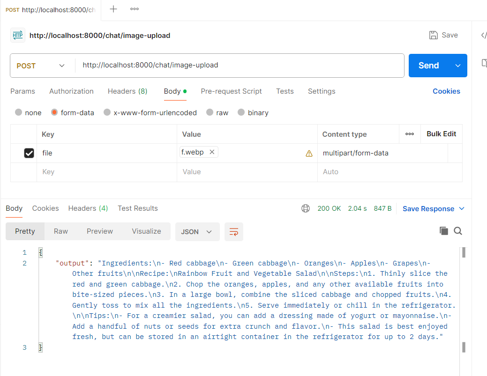

# 🍽️ PersonalChef

> An AI-powered personal chef assistant that generates recipes from ingredients — via text or image.

Built with **LangChain** · **LangGraph** · **Google Gemini** · **Tavily** · **FastAPI**

---

## Features

- **Text input** — describe your ingredients and get a full recipe
-  **Image upload** — snap a photo of ingredients for instant recipe suggestions
-  **Web search** — agent searches the web for the best matching recipes
- **Conversational memory** — retains context across turns in a session

---

## Project Structure

```
app/
├── agent/        # LangGraph agent engine
├── api/          # FastAPI routes & schemas
├── core/         # Config & environment
├── model/        # LLM setup (Gemini / Groq)
└── tools/        # Tavily web search tool
```

---

## Getting Started

### 1. Clone & install

```bash
git clone <repo-url>
cd PersonalChef
uv sync
```

### 2. Configure environment

```bash
cp .env.example .env
```

Edit `.env` and fill in your API keys:

```env
TAVILY_API_KEY=your_tavily_key
GROQ_API_KEY=your_groq_key
GOOGLE_API_KEY=your_google_api_key
```

### 3. Run the server

```bash
uvicorn app.api.app:app --reload
```

---

## API Endpoints

| Method | Endpoint | Description |
|--------|----------|-------------|
| `POST` | `/chat` | Send a text prompt with ingredients |
| `POST` | `/chat/image-upload` | Upload an image of ingredients |

### Example — text



### Example — image




## Response Format

```
Ingredients:
- item 1
- item 2

Recipe:
(short title)

Steps:
1. step one
2. step two

Tips:
- useful cooking tips
```

---

## Requirements


- [`uv`](https://docs.astral.sh/uv/) package manager
- Tavily API key — [get one here](https://tavily.com)
- Groq API key — [get one here](https://console.groq.com)
- GOOGLE API KEY
